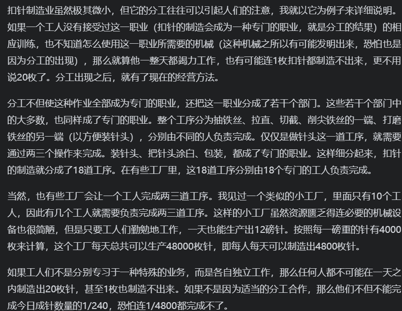

一国国民每年消费的全部生活必须品和便利品（包括国民的直接产物，或是这类从外国进口） 都来自于国民的劳动

国民生活供给好坏，取决生活必需品和便利品与消费人数的比例大小
这一比例受制两个因素：
本国国民运用劳动的熟练程度，技巧和判断力（更大程度）
本国从事有用劳动和不从事有用劳动的人数比例大小

第一篇讨论的是（劳动生产力是如何改良的，劳动的生产物又事按照何种顺序自然地向社会各级分配）

第二篇 资本的性质，资本积累的方法 以及因为资本用途不同其推动的劳动量也不同

第三篇：为什么欧洲各国都实行比较不利于农业产业而利于城市产业的政策 即鼓励手工业 制造业和商业的发展 人们为什么采用和规定这些政策

第四篇（农业产业和城市产业哪个更重要）在各时代和各国所产生的重要印象

前四篇国民的收入是如何构成的 以及不同的时代 不同的国家每年供应国民消费的财富性质

第五篇讨君主和国家的收入
赋税的来源
怎么募集全社会所有纳税人的经费
发行公债的原因 债务对土地和劳动产物的价值产生什么影响
经济学是在一定的时间背景下研究的

## 第一篇 论增进劳动力的因素，以及分配劳动生产物给各个阶层的自然顺序（不懂）

劳动生产力是如何改良的，劳动的生产物又事按照何种顺序自然地向社会各级分配

### 第一章 分工

分工出现后 劳动生产力得到了最大的增进 运用劳动熟练度，技巧和判断力得以加强(分工的好处)

社会一般业务分工所产生的的结果 可以通过考察个别制造业的分工状况来然人们易于理解(如何分析分工)

为什么分工在及其不重要（需求少）的行业 分工并不细密 但是大制造业部门划分更多 划分不想小制造业那么明显

但凡可以分工的 分工就是相应的增强劳动力生产 如果一个国家有着较高的产业和劳动生产力的增进水平 那么其在各行各业的分工也一定到达了较高水平

在未开化的区域中由一个人担任的工作 在进步社会中一般都由私人分任

在进步社会 各个人身份都是单一的 农民就是农民 制造者就是制造者

农业由于特殊性，所以不能进行细密的分，各种工作都不能想制造业那样截然分立

农业不能采用分工导致农业在劳动生产力的增进，总是更不上制造业的步伐 但是制造业发达的国家种植技术优于欠发达地区 但是 欠发达地区也能生产品质优良 便宜的 农作物 和富国竞争

而在制造业方面 富国在土壤 气候 位置 技术 人才 政策适宜制造业

为什么分工能提高劳动力

1. 因为专业而掌握技巧 更专一 熟练  职业 和 习惯
2. 免除由一种劳动到另一种劳动带来的损失（人们不可能很快从一种工作转换到另一种工作）农民即耕地也织布 切换工作转态心不在焉 导致农名 懒惰散漫
3. 随着分工发明代替人工的机器 一个人能做更多的事情

人的注意力如果集中于一个单一的事物 回比分散在许多事情上更容易发现 目标的更简易 更便利的方法 分工即使如此（不断发现工作的改良的方法 提高劳动力 发明机器）

还有一些改良来自哲学或思想 观察一切事物 常常把各种相去甚远没有关系的事物结合起来 随着社会的进步 哲学或思想成为某个特定阶层人们的主要业务或工作(那些工作)

哲学上的这种分工 取得了产业分工同样的效果 增进技巧和节省时间 提高效率 增进技术含量

### 第二章  分工的起源

来源于物品的交易(不断的交易就是经济的起源)

人类不同于动物 几乎随时需要同胞的协助(动物成年后全都在自然界独立, 种互通有无 物物交换倾向的产生)

如果没有这种互通有无 物物交换倾向的产生 那么每一个人要想取得生活上的一切必需品必须亲自生产 这样一来 所有人的任务和工作没有分别 当然不存在工作差异所产生的巨大才能的差异了

人类天赋的差异并没有我们想象的那么大  成年人在从事不同的职位上表现出非常不同的才能也是分工的结果

### 第三章 市场大小会限制分工

由于分工起源于交换,所以限制分工的程度就是交换能力的大小(市场的大小限制了分工的程度 ) 如果市场过小 人们就不能用 自己劳动生产的剩余部分,来随意换自己所需的别人劳动生产物的剩余部分,这一样他们不会终生从事某一职业

在人烟稀少的地方 一个人必须身兼数职(就算专业从事一个工作也没有市场 农村的铁匠)

有些业务只在大都市经营 比如搬运

## 第二篇 论资本的流通，积累和作用

资本的性质，资本积累的方法 以及因为资本用途不同其推动的劳动量也不同

## 第三篇 论不同国家资本主义发展的不同

为什么欧洲各国都实行比较不利于农业产业而利于城市产业的政策 即鼓励手工业 制造业和商业的发展 人们为什么采用和规定这些政策

## 第四篇 论政治经济学体系

（农业产业和城市产业哪个更重要）在各时代和各国所产生的重要印象

## 第五篇 论国家的收入

君主和国家的收入

